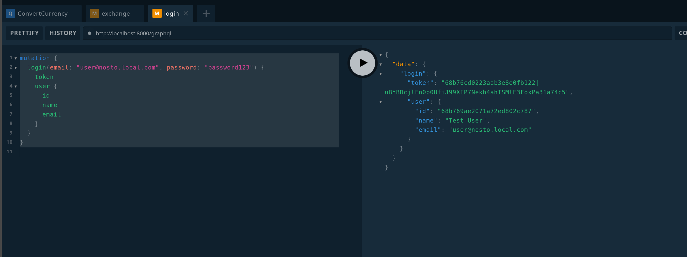
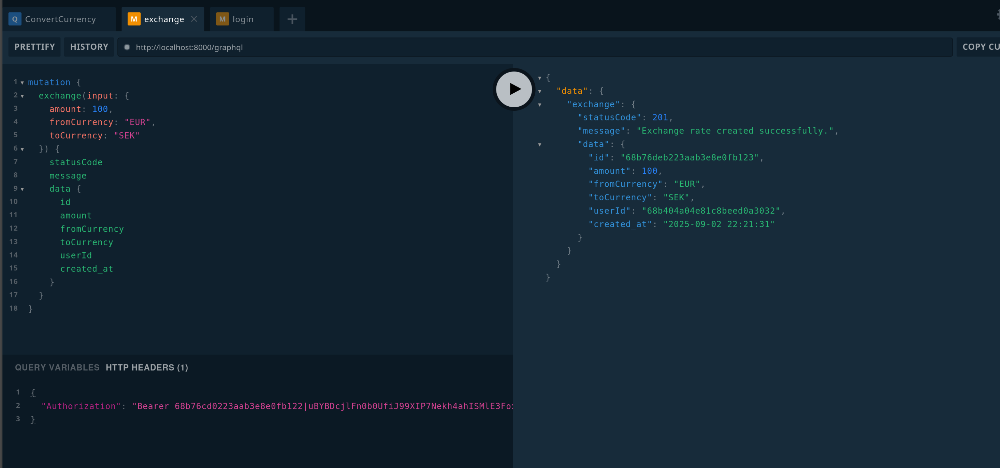

# Laravel Exchange Rate App

A simple Laravel 12 application with PHP 8.2 that supports GraphQL mutations, asynchronous jobs, and real-time updates through WebSockets.

---

## Stack
- **Backend:** Laravel 12, PHP 8.2
- **Database:** MongoDB
- **Real-time:** Soketi / Pusher
- **GraphQL:** Lighthouse

## Running Locally

### 1. Start Docker Containers

```bash
docker compose up -d
```
### 2. Enter the App Container
```bash
docker compose exec -it app bash
```
### 3. Run Migrations & Seed Database
```bash
php artisan migrate --seed
```
### 4. Open GraphQL Playground
http://localhost:8000/graphql-playground

### Sample Mutation
Use the following mutation to create a new exchange rate:
First login and copy the token:
Copy past this query into playground and run it:
```graphql
mutation {
    login(email: "user@nosto.local.com", password: "password123") {
        token
        user {
            id
            name
            email
        }
    }
}
```

Then copy past following object in HTTP HEADER on the buttom of the playground UI
```json
{
  "Authorization": "68b76cd0223aab3e8e0fb122|uBYBDcjlFn0b0UfiJ99XIP7Nekh4ahISMlE3FoxPa31a74c5"
}
```

And copy this query and run it.

```graphql
mutation {
  exchange(input: {
    amount: 100,
    fromCurrency: "EUR",
    toCurrency: "SEK"
  }) {
    statusCode
    message
    data {
      id
      amount
      fromCurrency
      toCurrency
      userId
      created_at
    }
  }
}
```


Now if you run this command you will see everytime you create a new exchange rate a new message like following publishes in the socket connection:

```json
⚡ HTTP Payload received:
{
  name: 'ExchangeRateResultReadyEvent',
  data: '{"exchangeRateId":"68b774cd10fbffe3cf080db2","result":1101.9839}',
  channel: 'private-user.68b404a04e81c8beed0a3032'
}
```
### How It Works
1. When the mutation is run, the request is inserted into the database.

2. An event is dispatched to trigger a background job.

3. The job calls a third-party service (Swop) to fetch the actual exchange rate.

4. Once the rate is fetched, another event is dispatched.

5. The final event publishes the result to a WebSocket channel, allowing clients to update the UI in real-time.

### Caching mechanism
We store our webservice call results in redis cache and we keep it for 5 minutes for each currency pair
Every graphql mutation to create a new exchange rate first checks if the value already exists in cache it wont dispatch the job at all
If the value did not exist in the cache then we trigger and event that dispatches a job and the job asynchronously calls the webservice and updates the result AND caches the result for next calls.
(I could implement a simple CQRS mechanism for this also)

###Graphana dashboard
All of the services are up and running right after docker compose up -d using supervisor so you can open this URL to see a sample dashboard.

http://localhost:3000/d/e6d34a83-5272-4c37-a034-be09cce591bc/nosto-overal-monitoring?orgId=1&refresh=30s

Metrics are exposed from /metrics endpoint using prometheus.

